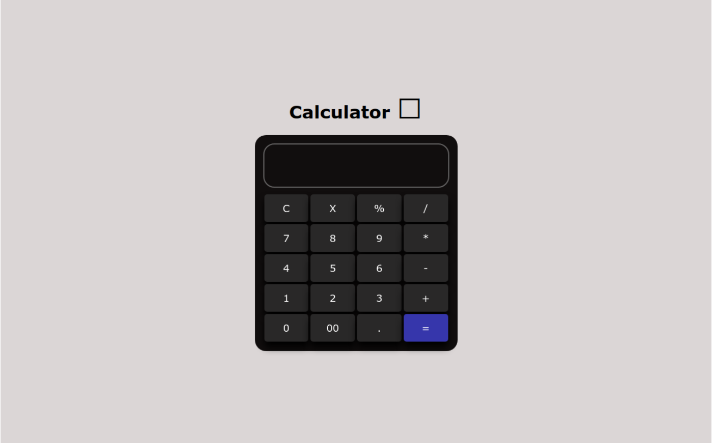

# Calculator Web App

## Description

I created this calculator web app project to practice my skills in HTML, CSS, and JavaScript. The motivation behind the project was to build a functional calculator that users can easily use for basic arithmetic operations. The project helped me solidify my understanding of event handling in JavaScript and improve my overall web development skills.

### Table of Contents

- [Installation](#installation)
- [Usage](#usage)
- [Technologies Used](#technologies-used)
- [Features](#features)
- [Project Structure](#project-structure)
- [Credits](#credits)
- [License](#license)



## Installation

To run this project locally, follow these steps:

1. Clone the repository to your local machine.
    ```bash
    git clone https://github.com/m-ramzan786/Calculator.git
    ```

2. Open the project folder in your code editor.

3. Open the `index.html` file in your web browser.

## Usage

To use the calculator:

1. Open the [live demo](https://calculator-sigma-one-31.vercel.app/) or run it locally.

2. Perform basic arithmetic operations such as addition, subtraction, multiplication, and division.

3. Use the provided buttons to input numbers and perform calculations.

4. Enjoy a seamless and user-friendly calculator experience.

## Technologies Used

- HTML
- CSS
- JavaScript (DOM manipulation)

## Features

- **User-Friendly Interface:** Simple and intuitive design for ease of use.

- **Basic Mathematical Operations:** Perform addition, subtraction, multiplication, and division.

- **Dynamic Display:** Instantly see the input and results on the calculator screen.

- **Clear Display:** Clear button for resetting the input.

- **Responsive:** Responsive design for various screen sizes.

## Project Structure

The project is structured for easy navigation and a clean, minimalist design.

## Credits

- [Muhammad Ramzan](https://github.com/m-ramzan786) - Project Creator

## License

This project is licensed under the [MIT License](LICENSE). Feel free to use and modify the code as per the license terms.

## Badges


## How to Contribute

If you'd like to contribute to the project, follow these steps:

1. Fork the project.
2. Create a new branch for your feature: `git checkout -b feature-name`.
3. Commit your changes: `git commit -m 'Add new feature'`.
4. Push to the branch: `git push origin feature-name`.
5. Open a pull request.

## Contact

If you have any questions, suggestions, or just want to connect, feel free to reach out:

- Email: [mramzanstv@gmail.com](mramzanstv@gmail.com)
- Portfolio: [Muhammad-Ramzan-Portfolio](https://muhammad-ramzan.vercel.app/)
- LinkedIn: [in/m-ramzan786](https://www.linkedin.com/in/m-ramzan786/)

## Tests

The project includes a set of tests to ensure the functionality is working as expected. To run the tests, use the following command:
```bash
npm test
```
Happy calculating!
